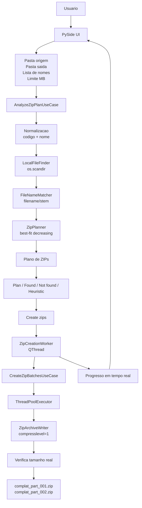

# COMPLAT

<p align="center">
  
</p>

<p align="center">
  <strong>Aplicativo desktop para localizar arquivos por lista de nomes e gerar ZIPs separados por limite de tamanho.</strong>
</p>

<p align="center">
  
  
  
  
  
</p>

COMPLAT e uma ferramenta local para analisar uma pasta, comparar os arquivos
existentes com uma lista de pessoas/nomes e gerar multiplos arquivos `.zip`
respeitando um limite configurado por parte. O caso principal e receber uma
lista colada do Excel ou de outro sistema, selecionar a pasta de origem,
verificar encontrados/nao encontrados e empacotar tudo em ZIPs menores.

O limite padrao e `9 MB`. A analise monta um plano antes da criacao, e a
criacao usa exatamente esse plano ja calculado, sem reanalisar escondido. A UI
fica responsiva porque a geracao dos ZIPs roda em thread separada, com feedback
visual de progresso.

## Destaques

- UI desktop em PySide6 com tema dark, moderno e minimalista.
- Icone e identidade visual embutidos no aplicativo.
- Fluxo em duas etapas: `Analyze plan` e depois `Create zips`.
- Criacao de ZIPs baseada no plano ja analisado em memoria.
- Barra de progresso em tempo real durante a geracao.
- Geracao fora da thread principal da interface.
- Escrita paralela de partes independentes com compressao rapida.
- Limite padrao de `9 MB` por ZIP.
- Entrada com nome simples ou `codigo + nome`.
- Busca usa apenas o nome, mas preserva codigo e nome nos resultados.
- Aba `Not found` separada em colunas `Code` e `Name`.
- Clique no codigo copia so o codigo; clique no nome copia so o nome.
- Aba `Plan` mostra a divisao dos ZIPs antes de criar.
- Aba `Heuristic` explica a estrategia aplicada.
- Arquitetura organizada em camadas, seguindo Clean Architecture e SOLID.

## Como Funciona



O fluxo principal comeca na interface PySide. A analise normaliza a lista
colada, extrai o nome quando a linha vem com codigo, procura arquivos na pasta
de origem e monta um plano de partes ZIP. Depois disso, a criacao usa o plano
em memoria e escreve as partes em paralelo, verificando o tamanho final real de
cada `.zip`.

## Requisitos

- Windows.
- Python 3.11 ou superior.
- PowerShell.

Dependencias principais:

- `PySide6-Essentials`
- `pytest` para desenvolvimento/testes

## Instalacao

Execute o setup na raiz do projeto:

```powershell
.\setup.ps1
```

O script:

- Cria o ambiente virtual local em `.venv`.
- Atualiza o `pip`.
- Instala dependencias de runtime.
- Instala dependencias de desenvolvimento.
- Instala o COMPLAT em modo editable.
- Cria os launchers locais `complat.cmd` e `complat-ui.cmd`.
- Adiciona a pasta do projeto ao `PATH` do usuario por padrao.

Depois de rodar o setup, abra um terminal novo e execute:

```powershell
complat-ui
```

Tambem e possivel abrir pela propria pasta do projeto:

```powershell
.\complat-ui
```

Para rodar o setup sem alterar o `PATH` do usuario:

```powershell
.\setup.ps1 -NoGlobalCommands
```

## Comeco Rapido

1. Abra o app:

```powershell
complat-ui
```

2. Selecione a pasta de origem em `Source`.
3. Selecione a pasta de saida em `Output`.
4. Cole a lista no painel `Names`.
5. Confira o limite, por padrao `9 MB`.
6. Clique em `Analyze plan`.
7. Revise as abas `Plan`, `Found`, `Not found` e `Heuristic`.
8. Clique em `Create zips`.

Os arquivos gerados seguem o formato:

```text
complat_part_001.zip
complat_part_002.zip
complat_part_003.zip
```

## Formato Da Entrada

Entrada somente com nomes:

```text
RICARDO DOS SANTOS GUIMARAES
MAYCON FERREIRA VALENTE
ADHO FRANKLIN ALONSO ALVES
```

Entrada com codigo e nome:

```text
45119983	RICARDO DOS SANTOS GUIMARAES
43479201	MAYCON FERREIRA VALENTE
45630607	ADHO FRANKLIN ALONSO ALVES
```

Quando a linha possui codigo:

- O codigo e preservado para exibicao.
- O nome e usado para procurar o arquivo.
- Na aba `Not found`, o codigo aparece em `Code`.
- O nome aparece em `Name`.
- Clicar em `Code` copia somente o codigo.
- Clicar em `Name` copia somente o nome.

## Regras De Busca

COMPLAT compara os nomes de forma case-insensitive contra:

- Nome exato do arquivo, por exemplo:

```text
RICARDO DOS SANTOS GUIMARAES.pdf
```

- Stem do arquivo, sem extensao:

```text
RICARDO DOS SANTOS GUIMARAES
```

Linhas duplicadas sao ignoradas depois da normalizacao.

## Planejamento Dos ZIPs

O planner usa a heuristica `best-fit decreasing`:

1. Ordena os arquivos encontrados do maior para o menor.
2. Tenta encaixar cada arquivo no lote com menor sobra possivel.
3. Cria um novo lote quando nenhum lote existente comporta o arquivo.
4. Mostra o plano na aba `Plan`.
5. Durante a criacao, mede o tamanho real final de cada `.zip`.

Essa estrategia e rapida, previsivel e evita carregar ZIPs inteiros em memoria.

## CLI

Analisar sem gerar ZIPs:

```powershell
complat `
  --folder "C:\Files" `
  --names-file ".\names.txt" `
  --max-mb 9 `
  --analyze-only
```

Gerar ZIPs:

```powershell
complat `
  --folder "C:\Files" `
  --names-file ".\names.txt" `
  --output-folder ".\zips" `
  --max-mb 9
```

Incluir subpastas:

```powershell
complat `
  --folder "C:\Files" `
  --names-file ".\names.txt" `
  --output-folder ".\zips" `
  --recursive
```

## Arquitetura

```text
src/complat/
  assets/
    complat.ico             Icone Windows do aplicativo
    complat.png             Logo/icone usado na UI
  domain/
    entities.py             Entidades de dominio
    services.py             Normalizacao, matching e planejamento
  application/
    ports.py                Contratos das dependencias externas
    use_cases.py            Casos de uso
    errors.py               Erros esperados da aplicacao
  infrastructure/
    filesystem.py           Busca rapida com os.scandir
    zip_writer.py           Escrita dos ZIPs
  presentation/
    cli.py                  Interface CLI
    composition.py          Composition root
    pyside_app.py           Entrada da UI
    pyside/
      main_window.py        Janela principal
      controller.py         Controller da UI
      workers.py            Worker em QThread
tests/
```

Direcao das dependencias:

```text
presentation -> application -> domain
infrastructure -> application/domain
```

As camadas `domain` e `application` nao importam PySide, `zipfile` ou detalhes
concretos do filesystem. Isso mantem a regra de negocio testavel e independente
da interface.

## Desenvolvimento

Instale o projeto:

```powershell
.\setup.ps1
```

Rode os testes:

```powershell
.venv\Scripts\python.exe -m pytest
```

Verifique a CLI:

```powershell
.\complat --help
```

Abra a UI:

```powershell
.\complat-ui
```

## Gerando Executavel

Para gerar o executavel Windows:

```powershell
.\build_exe.ps1 -Clean
```

O build usa PyInstaller em modo `onedir`, que abre mais rapido que `onefile`
porque nao precisa descompactar tudo em uma pasta temporaria a cada execucao.

Resultado:

```text
dist/COMPLAT/COMPLAT.exe
```

Para distribuir, envie a pasta inteira:

```text
dist/COMPLAT/
```

## Troubleshooting

Se `complat-ui` nao for reconhecido depois do setup, abra um terminal novo.
O `PATH` do usuario e atualizado, mas terminais ja abertos podem nao enxergar a
mudanca.

Se o PowerShell bloquear scripts:

```powershell
Set-ExecutionPolicy -Scope CurrentUser RemoteSigned
```

Depois rode novamente:

```powershell
.\setup.ps1
```

Se a criacao avisar que um ZIP excedeu o limite, significa que o tamanho real
final ficou acima do permitido. Nesse caso, reduza o limite ou separe
manualmente arquivos individuais muito grandes.

## Roadmap

Possiveis evolucoes:

- Exportar relatorio de encontrados e nao encontrados.
- Adicionar opcao para escolher prefixo dos ZIPs gerados.
- Permitir salvar/carregar uma configuracao de execucao.
- Adicionar tela de historico de geracoes.
- Criar instalador Windows.
- Adicionar screenshots oficiais no README.

## Licenca

Adicione uma licenca antes de distribuir este projeto publicamente.
